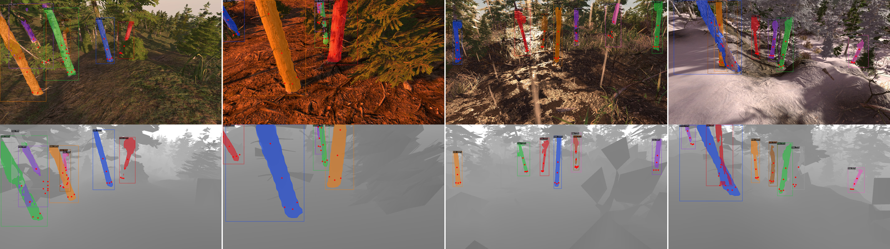

# PercepTreeV1
Official code repository for the papers:
- [Tree Detection and Diameter Estimation Based on Deep Learning](http://arxiv.org/abs/2210.04104), published in *Forestry: An International Journal Of Forest Research*.

  

- [Training Deep Learning Algorithms on Synthetic Forest Images for Tree Detection](http://arxiv.org/abs/2210.04104), presented at *ICRA 2022 IFRRIA Workshop*.

  

<!-- The version 1 of this project is done using synthetic forest dataset `SynthTree43k`, but soon we will release models fine-tuned on real-wolrd images. Plans to release SynthTree43k are underway.

The gif below shows how well the models trained on SynthTree43k transfer to real-world, without any fine-tuning on real-world images. -->
<!-- 

  

 -->

## Datasets
All our datasets are made available to increase the adoption of deep learning for many precision forestry problems.

<table>
  <tr>
    <th>Dataset name</th>
    <th>Description</th>
    <th>Download</th>
  </tr>
  <tr>
    <td>SynthTree43k</td>
    <td>A dataset containing 43 000 synthetic images and over 190 000 annotated trees. Includes images, train, test, and validation splits. </td>
    <td><a href="https://ulavaldti-my.sharepoint.com/:f:/g/personal/vigro7_ulaval_ca/EvdPF5CryRVAhlBYoqk05ysB2J82dYQU0j6PQ2WH-b7WDg?e=845PrC">OneDrive</a></td>
  <tr>
  <tr>
    <td>CanaTree100</td>
    <td>A dataset containing 100 real images and over 920 annotated trees collected in Canadian forests. Includes images, train, test, and validation splits for all five folds.</td>
    <td><a href="https://ulavaldti-my.sharepoint.com/:u:/g/personal/vigro7_ulaval_ca/EdxLqaVszr9LnSAcMaKnZtcBsbQ8hi4yNcmwTaMgDgM6Ww?e=tvbZgo">OneDrive</a></td>
  <tr>
</table>

## Pre-trained models
Pre-trained models weights are compatible with Detectron2 config files.
All models are trained on our synthetic dataset SynthTree43k.
We provide a demo file to try it out.

### Mask R-CNN trained on synthetic images (`SynthTree43k`)
<table>
  <tr>
    <th>Backbone</th>
    <th>Modality</th>
    <th>box AP50</th>
    <th>mask AP50</th>
    <th colspan="6">Download</th>
  </tr>
  <tr>
    <td>R-50-FPN</td>
    <td>RGB</td>
    <td>87.74</td>
    <td>69.36</td>
    <td><a href="https://drive.google.com/file/d/1pnJZ3Vc0SVTn_J8l_pwR4w1LMYnFHzhV/view?usp=sharing">model</a></td>
  <tr>
    <td>R-101-FPN</td>
    <td>RGB</td>
    <td>88.51</td>
    <td>70.53</td>
    <td><a href="https://drive.google.com/file/d/1ApKm914PuKm24kPl0sP7-XgG_Ottx5tJ/view?usp=sharing">model</a></td>
  <tr>
    <td>X-101-FPN</td>
    <td>RGB</td>
    <td>88.91</td>
    <td>71.07</td>
    <td><a href="https://drive.google.com/file/d/1Q5KV5beWVZXK_vlIED1jgpf4XJgN71ky/view?usp=sharing">model</a></td>
  </tr>
  <tr>
    <td>R-50-FPN</td>
    <td>Depth</td>
    <td>89.67</td>
    <td>70.66</td>
    <td><a href="https://drive.google.com/file/d/1bnH7ZSXWoOJx5AkbNeHf_McV46qiKIkY/view?usp=sharing">model</a></td>
  <tr>
    <td>R-101-FPN</td>
    <td>Depth</td>
    <td>89.89</td>
    <td>71.65</td>
    <td><a href="https://drive.google.com/file/d/1DgMscnTIGty7y9-VNcq1zERrevfT3b_L/view?usp=sharing">model</a></td>
  <tr>
    <td>X-101-FPN</td>
    <td>Depth</td>
    <td>87.41</td>
    <td>68.19</td>
    <td><a href="https://drive.google.com/file/d/1rsCbLSvFf2I47FJK4vhhv0du5uCV6zjO/view?usp=sharing">model</a></td>
  </tr>
</table>

## Demos
Once you have a working Detectron2 and OpenCV installation, running the demo is easy.

### Demo on a single image
- Download the pre-trained model weight and save it in the `/output` folder (of your local PercepTreeV1 repos).
-Open `demo_single_frame.py` and uncomment the model config corresponding to pre-trained model weights you downloaded previously, comment the others. Default is X-101. Set the `model_name` to the same name as your downloaded model ex.: 'X-101_RGB_60k.pth'
- In `demo_single_frame.py`, specify path to the image you want to try it on by setting the `image_path` variable.

### Demo on video
- Download the pre-trained model weight and save it in the `/output` folder (of your local PercepTreeV1 repos).
-Open `demo_video.py` and uncomment the model config corresponding to pre-trained model weights you downloaded previously, comment the others. Default is X-101.
- In `demo_video.py`, specify path to the video you want to try it on by setting the `video_path` variable.

The gif below shows how well the models trained on SynthTree43k transfer to real-world, without any fine-tuning on real-world images. -->

  

